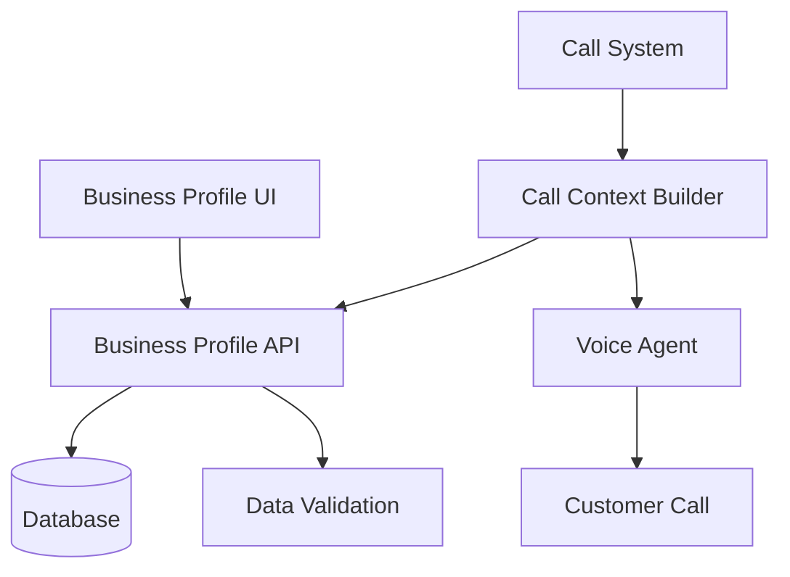

# Design Document

## Overview

The Business Profile Management system enables users to configure their business information for use by the AI voice agent during payment reminder calls. The system consists of a database schema, API endpoints, user interface, and integration with the existing call context system.

## Architecture

### High-Level Architecture



### Component Interaction

1. **User Interface** - React form for business profile management
2. **API Layer** - RESTful endpoints for CRUD operations
3. **Database Layer** - Persistent storage for business profiles
4. **Validation Layer** - Input validation and sanitization
5. **Integration Layer** - Call context enhancement with business data

## Components and Interfaces

### Database Schema

```sql
CREATE TABLE business_profiles (
  id TEXT PRIMARY KEY DEFAULT (lower(hex(randomblob(16)))),
  user_id TEXT NOT NULL,
  company_name TEXT NOT NULL,
  business_description TEXT,
  industry TEXT,
  support_phone TEXT NOT NULL,
  support_email TEXT,
  business_hours TEXT, -- JSON format
  preferred_payment_methods TEXT, -- JSON array
  created_at TIMESTAMP DEFAULT CURRENT_TIMESTAMP,
  updated_at TIMESTAMP DEFAULT CURRENT_TIMESTAMP,
  FOREIGN KEY (user_id) REFERENCES users(id) ON DELETE CASCADE,
  UNIQUE(user_id) -- One profile per user
);
```

### API Endpoints

#### GET /api/business-profile
- **Purpose**: Retrieve user's business profile
- **Authentication**: Required (user session)
- **Response**: Business profile object or 404 if not found

#### POST /api/business-profile
- **Purpose**: Create new business profile
- **Authentication**: Required (user session)
- **Validation**: All required fields, format validation
- **Response**: Created profile object

#### PUT /api/business-profile
- **Purpose**: Update existing business profile
- **Authentication**: Required (user session)
- **Validation**: All fields, partial updates allowed
- **Response**: Updated profile object

### Data Models

#### BusinessProfile Interface
```typescript
interface BusinessProfile {
  id: string;
  userId: string;
  companyName: string;
  businessDescription?: string;
  industry?: string;
  supportPhone: string;
  supportEmail?: string;
  businessHours?: BusinessHours;
  preferredPaymentMethods: PaymentMethod[];
  createdAt: Date;
  updatedAt: Date;
}

interface BusinessHours {
  monday?: string;
  tuesday?: string;
  wednesday?: string;
  thursday?: string;
  friday?: string;
  saturday?: string;
  sunday?: string;
}

type PaymentMethod = 'credit_card' | 'bank_transfer' | 'check' | 'cash' | 'online_portal';
type Industry = 'professional_services' | 'retail' | 'healthcare' | 'technology' | 'manufacturing' | 'other';
```

#### Enhanced Call Context
```typescript
interface EnhancedCallContext extends CallContext {
  businessProfile: {
    companyName: string;
    businessDescription?: string;
    industry?: string;
    supportPhone: string;
    supportEmail?: string;
    businessHours?: string;
    preferredPaymentMethods: string[];
  };
}
```

### User Interface Components

#### BusinessProfileForm Component
- **Location**: `/app/dashboard/business-profile/page.tsx`
- **Features**:
  - Form sections for different information types
  - Real-time validation
  - Character counter for description
  - Industry dropdown
  - Payment methods multi-select
  - Business hours configuration
  - Save/Cancel actions

#### Form Validation Rules
- **Company Name**: Required, 2-100 characters, alphanumeric + spaces/hyphens/apostrophes
- **Business Description**: Optional, max 500 words
- **Support Phone**: Required, E.164 format validation
- **Support Email**: Optional, valid email format
- **Industry**: Optional, predefined values only
- **Payment Methods**: Optional, predefined values only

## Correctness Properties

*A property is a characteristic or behavior that should hold true across all valid executions of a system-essentially, a formal statement about what the system should do. Properties serve as the bridge between human-readable specifications and machine-verifiable correctness guarantees.*

### Property 1: Profile Uniqueness
*For any* user ID, there should be at most one business profile associated with that user
**Validates: Requirements 5.2**

### Property 2: Required Field Validation
*For any* business profile creation or update, if required fields (company name, support phone) are missing or invalid, the operation should be rejected
**Validates: Requirements 1.2, 1.4, 3.1, 3.3**

### Property 3: Description Word Limit
*For any* business description input, if it exceeds 500 words, the validation should reject it
**Validates: Requirements 1.3, 3.2**

### Property 4: Phone Number Format
*For any* support phone number input, it should be validated against E.164 format before being accepted
**Validates: Requirements 1.4, 3.3**

### Property 5: User Data Isolation
*For any* user, they should only be able to access and modify their own business profile, never another user's profile
**Validates: Requirements 5.3**

### Property 6: Call Context Enhancement
*For any* payment reminder call, if a business profile exists for the user, it should be included in the call context passed to the voice agent
**Validates: Requirements 4.1, 4.2, 4.3, 4.4, 4.5**

### Property 7: Default Fallback Behavior
*For any* payment reminder call, if no business profile exists for the user, the system should use predefined default values without failing
**Validates: Requirements 4.6, 7.1, 7.2, 7.3, 7.4**

### Property 8: Data Persistence Consistency
*For any* successful business profile save operation, the data should be retrievable in subsequent requests with the same values
**Validates: Requirements 5.1, 5.6**

## Error Handling

### Validation Errors
- **Field-level validation**: Display errors inline with form fields
- **Form-level validation**: Prevent submission with invalid data
- **Server-side validation**: Return structured error responses

### API Error Responses
```typescript
interface ApiError {
  error: string;
  details?: string;
  fieldErrors?: Record<string, string>;
}
```

### Error Scenarios
1. **Missing required fields**: 400 Bad Request with field errors
2. **Invalid phone format**: 400 Bad Request with validation message
3. **Description too long**: 400 Bad Request with word count error
4. **Unauthorized access**: 401 Unauthorized
5. **Profile not found**: 404 Not Found
6. **Database errors**: 500 Internal Server Error

## Testing Strategy

### Unit Tests
- **API endpoint testing**: Test all CRUD operations
- **Validation logic**: Test all validation rules
- **Database operations**: Test profile creation, updates, retrieval
- **Error handling**: Test error scenarios and responses

### Property-Based Tests
- **Profile uniqueness**: Generate random user IDs and verify one profile per user
- **Validation rules**: Generate random inputs and verify validation behavior
- **Data persistence**: Generate random profile data and verify round-trip consistency
- **Call context integration**: Generate random profiles and verify proper context enhancement

### Integration Tests
- **End-to-end form submission**: Test complete user workflow
- **Call system integration**: Test business profile usage in actual calls
- **Authentication integration**: Test user isolation and access control

### Testing Configuration
- Minimum 100 iterations per property test
- Each property test tagged with: **Feature: business-profile-management, Property {number}: {property_text}**
- Use Jest for unit tests and fast-check for property-based testing