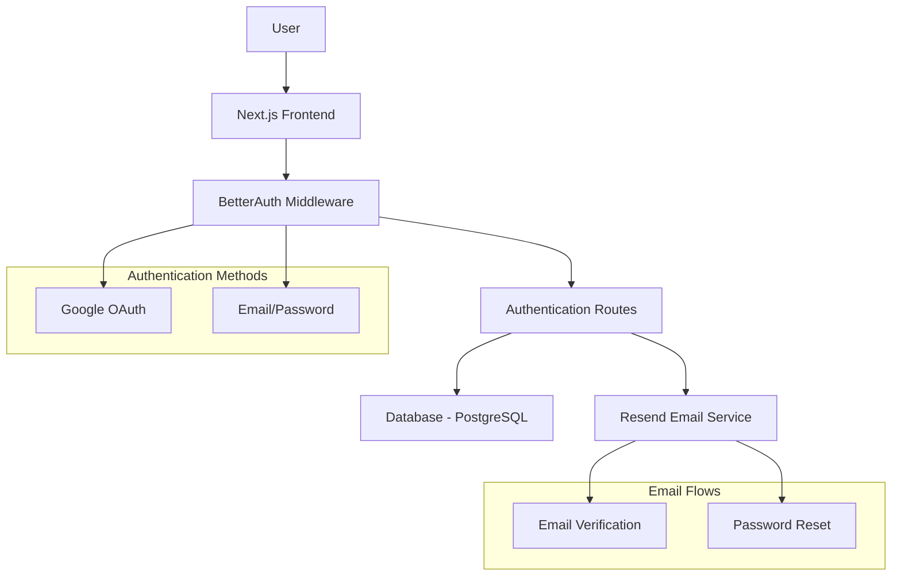

# Design Document: Email/Password Authentication

## Overview

This design extends the existing BetterAuth implementation to support email/password authentication alongside the current Google OAuth integration. The solution leverages BetterAuth's built-in email/password capabilities and integrates Resend for reliable email delivery.

## Architecture

### High-Level Architecture



### Component Integration

The design maintains the existing authentication architecture while extending it:

1. **BetterAuth Core**: Extended with email/password plugin
2. **Database Schema**: Utilizes existing schema with password field in accounts table
3. **Frontend Components**: Enhanced sign-in/sign-up pages with dual authentication options
4. **Email Service**: New Resend integration for authentication emails

## Components and Interfaces

### 1. BetterAuth Configuration Extension

**File**: `lib/auth.ts`

The existing BetterAuth configuration will be extended to include email/password authentication:

```typescript
import { emailOTP } from "better-auth/plugins"

export const auth = betterAuth({
  // ... existing configuration
  emailAndPassword: {
    enabled: true,
    requireEmailVerification: true,
    minPasswordLength: 8,
    maxPasswordLength: 128,
  },
  plugins: [
    // ... existing plugins
    emailOTP({
      async sendVerificationOTP({ email, otp, type }) {
        await sendEmail({
          to: email,
          subject: type === "email-verification" ? "Verify your email" : "Reset your password",
          template: type === "email-verification" ? "verify-email" : "reset-password",
          data: { otp, email }
        });
      },
    }),
  ],
})
```

### 2. Resend Email Service

**File**: `lib/email.ts`

New service for handling email communications:

```typescript
interface EmailTemplate {
  to: string;
  subject: string;
  template: 'verify-email' | 'reset-password' | 'welcome';
  data: Record<string, any>;
}

interface ResendService {
  sendEmail(params: EmailTemplate): Promise<void>;
  sendVerificationEmail(email: string, token: string): Promise<void>;
  sendPasswordResetEmail(email: string, token: string): Promise<void>;
}
```

### 3. Enhanced Authentication Components

**Files**: `app/sign-in/page.tsx`, `app/sign-up/page.tsx`

Updated components supporting dual authentication methods:

```typescript
interface AuthFormProps {
  mode: 'signin' | 'signup';
  onSubmit: (data: AuthFormData) => Promise<void>;
  loading: boolean;
}

interface AuthFormData {
  email: string;
  password: string;
  confirmPassword?: string; // Only for signup
}
```

### 4. Password Reset Flow

**Files**: `app/forgot-password/page.tsx`, `app/reset-password/page.tsx`

New components for password recovery:

```typescript
interface ForgotPasswordForm {
  email: string;
}

interface ResetPasswordForm {
  token: string;
  password: string;
  confirmPassword: string;
}
```

## Data Models

### Existing Schema Utilization

The current database schema already supports email/password authentication:

- **user table**: Contains email, emailVerified fields
- **account table**: Contains password field for credential storage
- **verification table**: Used for email verification and password reset tokens

### Email Templates Data Model

```typescript
interface EmailTemplateData {
  verifyEmail: {
    email: string;
    verificationUrl: string;
    appName: string;
  };
  resetPassword: {
    email: string;
    resetUrl: string;
    appName: string;
    expiresIn: string;
  };
  welcome: {
    name: string;
    email: string;
    dashboardUrl: string;
  };
}
```

## Correctness Properties

*A property is a characteristic or behavior that should hold true across all valid executions of a system-essentially, a formal statement about what the system should do. Properties serve as the bridge between human-readable specifications and machine-verifiable correctness guarantees.*

### Property Reflection

After analyzing all acceptance criteria, I identified several properties that can be consolidated:
- Properties 1.2, 2.2, and 2.6 all relate to successful authentication flows and can be combined
- Properties 1.3, 1.4, and 5.1 all relate to input validation and can be consolidated
- Properties 4.2 and 4.5 both relate to token management and can be combined
- Properties 6.3, 6.4, and 6.5 all relate to UI feedback and can be consolidated

### Correctness Properties

Property 1: Valid registration creates accounts
*For any* valid email and password combination meeting security requirements, registration should successfully create a new user account and trigger email verification
**Validates: Requirements 1.2, 1.6**

Property 2: Input validation rejects invalid data
*For any* invalid email format or password not meeting strength requirements, the system should reject the input and display appropriate validation errors
**Validates: Requirements 1.3, 1.4, 5.1**

Property 3: Authentication with valid credentials succeeds
*For any* verified user with correct email and password, sign-in should authenticate the user and create a secure session
**Validates: Requirements 2.2, 2.6**

Property 4: Authentication with invalid credentials fails securely
*For any* incorrect email/password combination, the system should reject authentication without revealing which field is incorrect
**Validates: Requirements 2.3**

Property 5: Unverified accounts are restricted
*For any* user with an unverified email address, attempts to sign in or access protected features should prompt for email verification
**Validates: Requirements 2.4, 4.4**

Property 6: Password reset emails are sent appropriately
*For any* email address (existing or non-existent), password reset requests should either send a reset email or display a generic success message for security
**Validates: Requirements 3.2, 3.3**

Property 7: Password updates invalidate reset tokens and sessions
*For any* successful password change, the system should update the password, invalidate the reset token, and invalidate all other user sessions
**Validates: Requirements 3.5, 5.4**

Property 8: Token validation and lifecycle management
*For any* verification or reset token, the system should validate tokens correctly, mark them as used when consumed, and invalidate previous tokens when new ones are generated
**Validates: Requirements 4.2, 4.5**

Property 9: Email sending timing and rate limiting
*For any* authentication email request, the system should send emails promptly (within 30 seconds) and enforce rate limiting (max 3 per hour per email)
**Validates: Requirements 4.1, 7.4**

Property 10: Password security and hashing
*For any* password stored in the system, it should be hashed using a secure algorithm and never stored in plain text
**Validates: Requirements 5.2**

Property 11: Recent authentication requirements
*For any* sensitive operation, the system should verify that the user has authenticated recently (within 30 minutes)
**Validates: Requirements 5.5**

Property 12: UI state preservation and feedback
*For any* user interaction with authentication forms, the system should preserve selected authentication methods across mode switches and provide appropriate loading states and feedback
**Validates: Requirements 6.2, 6.3, 6.4, 6.5**

Property 13: Email template consistency
*For any* authentication email sent through Resend, it should use branded templates consistent with the application design
**Validates: Requirements 7.2, 7.5**

Property 14: Email delivery error handling
*For any* failed email delivery, the system should log the error and provide fallback instructions to the user
**Validates: Requirements 7.3**

## Error Handling

### Authentication Errors

1. **Invalid Credentials**: Generic error messages that don't reveal whether email or password is incorrect
2. **Account Lockout**: Temporary lockout after 5 failed attempts with clear messaging about lockout duration
3. **Unverified Email**: Clear prompts to verify email with option to resend verification
4. **Expired Tokens**: Clear error messages with instructions to request new tokens

### Email Service Errors

1. **Resend API Failures**: Graceful degradation with fallback instructions
2. **Rate Limiting**: Clear messaging about email limits with retry timing
3. **Invalid Email Addresses**: Validation before attempting to send
4. **Template Errors**: Fallback to plain text emails if template rendering fails

### Database Errors

1. **Connection Issues**: Retry logic with exponential backoff
2. **Constraint Violations**: User-friendly messages for duplicate emails
3. **Transaction Failures**: Proper rollback and error reporting

## Testing Strategy

### Dual Testing Approach

The implementation will use both unit tests and property-based tests for comprehensive coverage:

**Unit Tests**: Focus on specific examples, edge cases, and integration points
- Specific email format validation examples
- Account lockout scenarios after exactly 5 failed attempts
- Token expiration edge cases
- UI component rendering with different states

**Property-Based Tests**: Verify universal properties across all inputs
- Password validation across randomly generated passwords
- Email validation across randomly generated email formats
- Authentication flows with randomly generated valid credentials
- Token lifecycle management with various token states

### Property-Based Testing Configuration

- **Testing Library**: fast-check for TypeScript/JavaScript property-based testing
- **Test Iterations**: Minimum 100 iterations per property test
- **Test Tagging**: Each property test tagged with format: **Feature: email-password-authentication, Property {number}: {property_text}**

### Integration Testing

- **Email Integration**: Test Resend integration with test API keys
- **Database Integration**: Test with test database for user creation and authentication flows
- **UI Integration**: Test complete authentication flows through the UI components

### Security Testing

- **Password Hashing**: Verify bcrypt/argon2 implementation
- **Session Security**: Test session invalidation and security
- **Rate Limiting**: Test email rate limiting enforcement
- **Token Security**: Test token generation, validation, and expiration

## Implementation Notes

### BetterAuth Plugin Configuration

The implementation will leverage BetterAuth's built-in email/password capabilities with custom email integration:

```typescript
// Custom email sending function for BetterAuth
const sendEmail = async ({ to, subject, template, data }) => {
  const resend = new Resend(process.env.RESEND_API_KEY);
  
  return await resend.emails.send({
    from: 'InvoCall <noreply@invocall.com>',
    to,
    subject,
    react: getEmailTemplate(template, data),
  });
};
```

### Database Migration Considerations

The existing schema already supports email/password authentication. No additional migrations are required as the `account` table already includes the `password` field.

### Environment Variables

New environment variables required:
- `RESEND_API_KEY`: API key for Resend email service
- `BETTER_AUTH_SECRET`: Already exists, used for session encryption
- `NEXT_PUBLIC_APP_URL`: Already exists, used for email links

### Security Considerations

1. **Password Requirements**: Minimum 8 characters with complexity requirements
2. **Rate Limiting**: Email sending limited to prevent abuse
3. **Token Expiration**: Verification tokens expire in 24 hours, reset tokens in 1 hour
4. **Session Security**: Secure session cookies with proper flags
5. **CSRF Protection**: Built into BetterAuth middleware