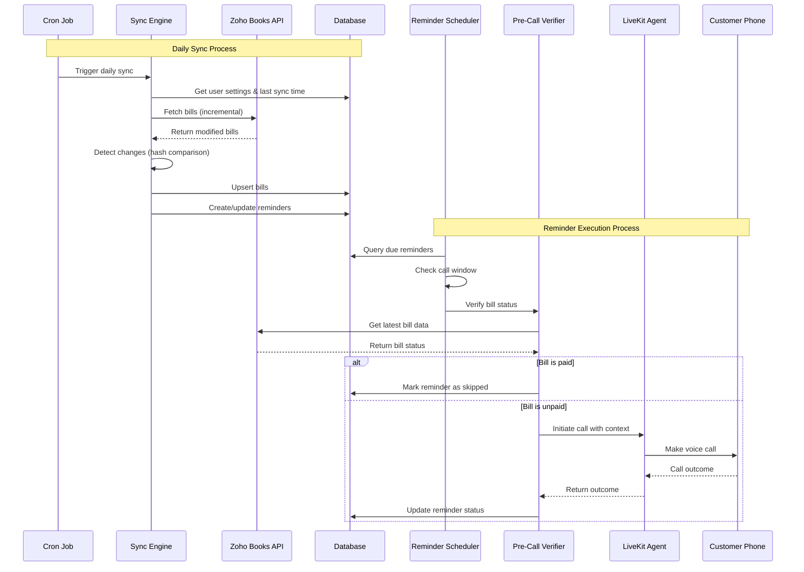

# Design Document: Payment Reminder Calls

## Overview

The Payment Reminder Call system is an automated voice calling solution that integrates with Zoho Books to remind customers about upcoming and overdue bill payments. The system employs intelligent bill synchronization, user-configurable reminder schedules, timezone-aware call windows, and pre-call verification to ensure accurate and timely payment reminders.

### Key Design Principles

1. **Efficiency First**: Incremental sync with change detection minimizes API calls and database operations
2. **User Control**: Full configurability of reminder schedules, call timing, and preferences
3. **Accuracy**: Pre-call verification ensures customers are never called about paid bills
4. **Timezone Awareness**: Respects business hours in user's configured timezone
5. **Scalability**: Multi-tenant architecture supports multiple users with isolated data

## Architecture

### High-Level Architecture

```
┌─────────────────────────────────────────────────────────────┐
│                     User Dashboard (Next.js)                │
│  ┌──────────────────┐  ┌──────────────────┐                │
│  │ Settings UI      │  │ Reminders View   │                │
│  └──────────────────┘  └──────────────────┘                │
└─────────────────────────────────────────────────────────────┘
                              │
                              ▼
┌─────────────────────────────────────────────────────────────┐
│                    API Layer (Next.js API Routes)           │
│  ┌──────────────┐  ┌──────────────┐  ┌──────────────┐     │
│  │ Settings API │  │ Reminders API│  │ Sync API     │     │
│  └──────────────┘  └──────────────┘  └──────────────┘     │
└─────────────────────────────────────────────────────────────┘
                              │
                              ▼
┌─────────────────────────────────────────────────────────────┐
│                    Business Logic Layer                     │
│  ┌──────────────────────────────────────────────────┐      │
│  │  Sync Engine                                     │      │
│  │  - Daily Sync Job                                │      │
│  │  - Incremental Sync                              │      │
│  │  - Change Detection                              │      │
│  │  - Reminder Creation                             │      │
│  └──────────────────────────────────────────────────┘      │
│  ┌──────────────────────────────────────────────────┐      │
│  │  Reminder Scheduler                              │      │
│  │  - Reminder Query                                │      │
│  │  - Call Window Check                             │      │
│  │  - Pre-Call Verification                         │      │
│  │  - Call Queue Management                         │      │
│  └──────────────────────────────────────────────────┘      │
│  ┌──────────────────────────────────────────────────┐      │
│  │  Call Executor                                   │      │
│  │  - LiveKit Integration                           │      │
│  │  - Context Preparation                           │      │
│  │  - Outcome Tracking                              │      │
│  │  - Retry Logic                                   │      │
│  └──────────────────────────────────────────────────┘      │
└─────────────────────────────────────────────────────────────┘
                              │
                              ▼
┌─────────────────────────────────────────────────────────────┐
│                    Data Layer (PostgreSQL)                  │
│  ┌──────────────┐  ┌──────────────┐  ┌──────────────┐     │
│  │ Bills Cache  │  │ Reminders    │  │ Settings     │     │
│  └──────────────┘  └──────────────┘  └──────────────┘     │
└─────────────────────────────────────────────────────────────┘
                              │
                              ▼
┌─────────────────────────────────────────────────────────────┐
│                    External Services                        │
│  ┌──────────────────┐           ┌──────────────────┐       │
│  │  Zoho Books API  │           │  LiveKit Agent   │       │
│  │  - Bill Sync     │           │  - Voice Calls   │       │
│  │  - Verification  │           │  - Call Outcomes │       │
│  └──────────────────┘           └──────────────────┘       │
└─────────────────────────────────────────────────────────────┘
```

### Component Interaction Flow



## Components and Interfaces

### 1. Sync Engine

**Responsibility**: Synchronize bills from Zoho Books and manage reminder creation

**Key Functions**:
- `syncBillsForUser(userId: string): Promise<SyncResult>`
- `calculateSyncWindow(settings: ReminderSettings): number`
- `processAndUpsertBill(userId: string, zohoBill: ZohoBill): Promise<void>`
- `detectChanges(existingBill: Bill, zohoBill: ZohoBill): BillChanges`
- `handleBillChanges(billId: number, changes: BillChanges): Promise<void>`
- `createRemindersForBill(billId: number, userId: string, dueDate: Date): Promise<void>`
- `cleanupBillsOutsideWindow(userId: string, windowStart: Date, windowEnd: Date): Promise<void>`

**Interfaces**:
```typescript
interface SyncResult {
  billsFetched: number;
  billsInserted: number;
  billsUpdated: number;
  remindersCreated: number;
  errors: string[];
}

interface BillChanges {
  dueDateChanged: boolean;
  amountChanged: boolean;
  statusChanged: boolean;
  phoneChanged: boolean;
}
```

### 2. Reminder Scheduler

**Responsibility**: Identify due reminders and manage call queue

**Key Functions**:
- `processReminders(): Promise<void>`
- `canMakeCallNow(reminder: Reminder, settings: ReminderSettings): Promise<boolean>`
- `getCurrentTimeInTimezone(timezone: string): Date`
- `checkIfHoliday(date: Date, countryCode: string): Promise<boolean>`
- `queueCall(reminder: Reminder): Promise<void>`

**Interfaces**:
```typescript
interface CallWindowCheck {
  canCall: boolean;
  reason?: string;
  nextAvailableTime?: Date;
}
```

### 3. Pre-Call Verifier

**Responsibility**: Verify bill status before making calls

**Key Functions**:
- `verifyBillStatus(billId: number): Promise<BillVerification>`
- `prepareFreshContext(bill: Bill): CallContext`

**Interfaces**:
```typescript
interface BillVerification {
  isPaid: boolean;
  currentStatus: string;
  amountDue: number;
  shouldProceed: boolean;
}

interface CallContext {
  customerName: string;
  billNumber: string;
  originalAmount: number;
  amountDue: number;
  dueDate: string;
  daysUntilDue: number;
  isOverdue: boolean;
  paymentMethods: string[];
  companyName: string;
  supportPhone: string;
}
```

### 4. Call Executor

**Responsibility**: Execute calls via LiveKit and track outcomes

**Key Functions**:
- `initiateCall(reminder: Reminder, context: CallContext): Promise<CallOutcome>`
- `handleCallOutcome(reminderId: number, outcome: CallOutcome): Promise<void>`
- `scheduleRetry(reminderId: number, delayHours: number): Promise<void>`

**Interfaces**:
```typescript
interface CallOutcome {
  connected: boolean;
  duration: number;
  customerResponse: 'will_pay_today' | 'already_paid' | 'dispute' | 'no_answer' | 'other';
  notes?: string;
  livekitCallId?: string;
}
```

### 5. Settings Manager

**Responsibility**: Manage user reminder settings

**Key Functions**:
- `getUserSettings(userId: string): Promise<ReminderSettings>`
- `updateUserSettings(userId: string, settings: Partial<ReminderSettings>): Promise<void>`
- `validateSettings(settings: Partial<ReminderSettings>): ValidationResult`

**Interfaces**:
```typescript
interface ReminderSettings {
  userId: string;
  organizationId: string;
  
  // Reminder schedule
  reminder30DaysBefore: boolean;
  reminder15DaysBefore: boolean;
  reminder7DaysBefore: boolean;
  reminder5DaysBefore: boolean;
  reminder3DaysBefore: boolean;
  reminder1DayBefore: boolean;
  reminderOnDueDate: boolean;
  reminder1DayOverdue: boolean;
  reminder3DaysOverdue: boolean;
  reminder7DaysOverdue: boolean;
  customReminderDays: number[];
  
  // Call timing
  callTimezone: string;
  callStartTime: string;
  callEndTime: string;
  callDaysOfWeek: number[];
  
  // Country settings
  countryCode: string;
  skipHolidays: boolean;
  
  // Retry settings
  maxRetryAttempts: number;
  retryDelayHours: number;
}
```

### 6. Zoho Books Client

**Responsibility**: Interface with Zoho Books API

**Key Functions**:
- `getBills(filters: BillFilters): Promise<ZohoBill[]>`
- `getBillById(billId: string): Promise<ZohoBill>`
- `authenticate(): Promise<void>`

**Interfaces**:
```typescript
interface BillFilters {
  status?: string[];
  dueDateMin?: Date;
  dueDateMax?: Date;
  lastModifiedAfter?: Date;
  organizationId: string;
}

interface ZohoBill {
  bill_id: string;
  customer_id: string;
  customer_name: string;
  customer_phone: string;
  bill_number: string;
  total: number;
  balance: number;
  due_date: string;
  status: string;
  last_modified_time: string;
}
```

### 7. LiveKit Client

**Responsibility**: Interface with LiveKit for voice calls

**Key Functions**:
- `makeCall(phoneNumber: string, agentPrompt: string, context: CallContext): Promise<CallOutcome>`
- `getCallStatus(callId: string): Promise<CallStatus>`

## Data Models

### Database Schema

```sql
-- User reminder settings
CREATE TABLE reminder_settings (
  id SERIAL PRIMARY KEY,
  user_id VARCHAR(255) UNIQUE NOT NULL,
  organization_id VARCHAR(255),
  
  -- Reminder schedule
  reminder_30_days_before BOOLEAN DEFAULT false,
  reminder_15_days_before BOOLEAN DEFAULT false,
  reminder_7_days_before BOOLEAN DEFAULT true,
  reminder_5_days_before BOOLEAN DEFAULT false,
  reminder_3_days_before BOOLEAN DEFAULT true,
  reminder_1_day_before BOOLEAN DEFAULT true,
  reminder_on_due_date BOOLEAN DEFAULT true,
  reminder_1_day_overdue BOOLEAN DEFAULT true,
  reminder_3_days_overdue BOOLEAN DEFAULT true,
  reminder_7_days_overdue BOOLEAN DEFAULT false,
  custom_reminder_days JSONB DEFAULT '[]',
  
  -- Call timing
  call_timezone VARCHAR(50) DEFAULT 'UTC',
  call_start_time TIME DEFAULT '09:00:00',
  call_end_time TIME DEFAULT '18:00:00',
  call_days_of_week JSONB DEFAULT '[1,2,3,4,5]',
  
  -- Country settings
  country_code VARCHAR(10) DEFAULT 'US',
  skip_holidays BOOLEAN DEFAULT true,
  
  -- Retry settings
  max_retry_attempts INTEGER DEFAULT 3,
  retry_delay_hours INTEGER DEFAULT 2,
  
  created_at TIMESTAMP DEFAULT NOW(),
  updated_at TIMESTAMP DEFAULT NOW()
);

-- Bills cache
CREATE TABLE bills_cache (
  id SERIAL PRIMARY KEY,
  user_id VARCHAR(255) NOT NULL,
  zoho_bill_id VARCHAR(255) NOT NULL,
  
  -- Bill details
  customer_id VARCHAR(255),
  customer_name VARCHAR(255),
  customer_phone VARCHAR(50),
  customer_country_code VARCHAR(10),
  customer_timezone VARCHAR(50),
  bill_number VARCHAR(100),
  amount_total DECIMAL(10,2),
  amount_due DECIMAL(10,2),
  due_date DATE NOT NULL,
  status VARCHAR(50),
  
  -- Change tracking
  zoho_last_modified_at TIMESTAMP,
  local_last_synced_at TIMESTAMP,
  sync_hash VARCHAR(64),
  
  -- Reminder tracking
  reminders_created BOOLEAN DEFAULT false,
  
  created_at TIMESTAMP DEFAULT NOW(),
  updated_at TIMESTAMP DEFAULT NOW(),
  
  UNIQUE(user_id, zoho_bill_id),
  INDEX idx_user_due_date (user_id, due_date),
  INDEX idx_user_status (user_id, status)
);

-- Payment reminders
CREATE TABLE payment_reminders (
  id SERIAL PRIMARY KEY,
  bill_id INTEGER REFERENCES bills_cache(id) ON DELETE CASCADE,
  user_id VARCHAR(255) NOT NULL,
  
  -- Reminder details
  reminder_type VARCHAR(50) NOT NULL,
  scheduled_date DATE NOT NULL,
  status VARCHAR(50) DEFAULT 'pending',
  
  -- Attempt tracking
  attempt_count INTEGER DEFAULT 0,
  last_attempt_at TIMESTAMP,
  
  -- Call outcome
  call_outcome JSONB,
  skip_reason VARCHAR(255),
  
  created_at TIMESTAMP DEFAULT NOW(),
  updated_at TIMESTAMP DEFAULT NOW(),
  
  INDEX idx_user_scheduled_status (user_id, scheduled_date, status),
  INDEX idx_bill_id (bill_id),
  INDEX idx_scheduled_date (scheduled_date)
);

-- Sync metadata
CREATE TABLE sync_metadata (
  id SERIAL PRIMARY KEY,
  user_id VARCHAR(255) UNIQUE NOT NULL,
  last_full_sync_at TIMESTAMP,
  last_incremental_sync_at TIMESTAMP,
  sync_window_days INTEGER,
  created_at TIMESTAMP DEFAULT NOW(),
  updated_at TIMESTAMP DEFAULT NOW()
);

-- Holiday calendar
CREATE TABLE holidays (
  id SERIAL PRIMARY KEY,
  country_code VARCHAR(10) NOT NULL,
  holiday_date DATE NOT NULL,
  holiday_name VARCHAR(255),
  is_business_day BOOLEAN DEFAULT false,
  
  UNIQUE(country_code, holiday_date),
  INDEX idx_country_date (country_code, holiday_date)
);
```

## Correctness Properties

*A property is a characteristic or behavior that should hold true across all valid executions of a system—essentially, a formal statement about what the system should do. Properties serve as the bridge between human-readable specifications and machine-verifiable correctness guarantees.*

### Property 1: Sync Window Consistency

*For any* user with reminder settings, the sync window should always be at least as large as the maximum enabled reminder days plus a buffer.

**Validates: Requirements 4.3, 4.4, 4.5**

### Property 2: No Duplicate Bills

*For any* user and Zoho bill ID combination, there should exist at most one bill record in the bills cache.

**Validates: Requirements 6.1, 6.3**

### Property 3: Reminder Creation Idempotency

*For any* bill with reminders_created flag set to true, creating reminders again should not result in duplicate reminder records.

**Validates: Requirements 6.5, 7.4**

### Property 4: Future Reminders Only

*For any* bill and reminder schedule, all created reminders should have scheduled dates that are greater than or equal to the current date.

**Validates: Requirements 7.2, 7.3**

### Property 5: Paid Bill Reminder Cancellation

*For any* bill that transitions to paid status, all pending reminders associated with that bill should be marked as skipped.

**Validates: Requirements 5.3, 8.5**

### Property 6: Due Date Change Triggers Reminder Recreation

*For any* bill whose due date changes, all existing pending reminders should be deleted and new reminders should be created based on the new due date.

**Validates: Requirements 5.4**

### Property 7: Pre-Call Verification Prevents Paid Bill Calls

*For any* reminder that undergoes pre-call verification, if the bill status is paid, the call should be skipped and the reminder should be marked as skipped.

**Validates: Requirements 8.2, 8.3**

### Property 8: Call Window Enforcement

*For any* reminder and user settings, a call should only be initiated if the current time in the user's timezone falls within the configured call window and on an allowed day of the week.

**Validates: Requirements 2.5, 2.6**

### Property 9: Holiday Skipping

*For any* reminder scheduled on a holiday when holiday skipping is enabled, the call should not be initiated on that day.

**Validates: Requirements 3.3**

### Property 10: Retry Limit Enforcement

*For any* reminder, the number of call attempts should never exceed the user's configured maximum retry attempts.

**Validates: Requirements 9.7, 14.4**

### Property 11: Hash-Based Change Detection

*For any* bill, if the calculated hash differs from the stored hash, the bill should be identified as modified and updated in the cache.

**Validates: Requirements 5.1, 5.2**

### Property 12: Incremental Sync Efficiency

*For any* sync operation after the first full sync, only bills modified since the last sync timestamp should be fetched from Zoho Books.

**Validates: Requirements 4.8**

### Property 13: Reminder Status Transitions

*For any* reminder, status transitions should follow valid paths: pending → queued → in_progress → (completed | failed), or pending → skipped.

**Validates: Requirements 10.2, 10.3, 10.4, 10.5, 10.6, 10.7**

### Property 14: User Data Isolation

*For any* two different users, bills and reminders belonging to one user should not be accessible or modifiable by operations for the other user.

**Validates: Requirements 13.3, 13.4, 13.5**

### Property 15: Fresh Context Preparation

*For any* call initiation, the call context should contain the most recent bill data fetched during pre-call verification.

**Validates: Requirements 8.6, 15.1-15.9**

## Error Handling

### Zoho API Errors

**Error Types**:
- Rate limit exceeded
- Authentication failure
- Network timeout
- Invalid bill ID
- API unavailable

**Handling Strategy**:
1. Implement exponential backoff for rate limits
2. Refresh OAuth tokens on authentication failures
3. Retry with timeout for network errors (max 3 attempts)
4. Log and skip invalid bill IDs
5. Queue sync for retry if API unavailable

### LiveKit API Errors

**Error Types**:
- Call initiation failure
- Invalid phone number
- Agent unavailable
- Network timeout

**Handling Strategy**:
1. Mark reminder for retry on call initiation failure
2. Mark reminder as failed for invalid phone numbers
3. Retry with backoff for network timeouts
4. Alert administrators if agent consistently unavailable

### Database Errors

**Error Types**:
- Connection failure
- Constraint violation
- Query timeout
- Deadlock

**Handling Strategy**:
1. Implement connection pooling with retry logic
2. Log constraint violations and skip operation
3. Increase timeout for complex queries
4. Retry transactions on deadlock detection

### Validation Errors

**Error Types**:
- Invalid timezone
- Invalid time range
- Invalid custom reminder days
- Missing required fields

**Handling Strategy**:
1. Validate all user inputs before saving
2. Provide clear error messages to users
3. Use default values for optional fields
4. Reject invalid configurations with explanations

## Testing Strategy

### Unit Tests

Unit tests will verify specific examples, edge cases, and error conditions for individual functions and components.

**Focus Areas**:
- Settings validation logic
- Hash calculation for bills
- Change detection logic
- Time window calculations
- Timezone conversions
- Reminder schedule building
- Status transition logic

**Example Unit Tests**:
- Test that invalid timezone strings are rejected
- Test that call window correctly identifies times outside range
- Test that hash calculation produces consistent results
- Test that change detection identifies all change types
- Test that reminder schedule respects user settings

### Property-Based Tests

Property-based tests will verify universal properties across all inputs using randomized test data. Each test will run a minimum of 100 iterations.

**Testing Framework**: We will use `fast-check` for TypeScript property-based testing.

**Test Configuration**:
```typescript
import fc from 'fast-check';

// Example configuration
fc.assert(
  fc.property(/* generators */, (/* inputs */) => {
    // Property assertion
  }),
  { numRuns: 100 } // Minimum 100 iterations
);
```

**Property Test Mapping**:

1. **Property 1 Test**: Generate random user settings, verify sync window calculation
   - **Feature: payment-reminder-calls, Property 1**: Sync window consistency

2. **Property 2 Test**: Generate random bills, verify no duplicates after upsert
   - **Feature: payment-reminder-calls, Property 2**: No duplicate bills

3. **Property 3 Test**: Generate random bills, create reminders twice, verify no duplicates
   - **Feature: payment-reminder-calls, Property 3**: Reminder creation idempotency

4. **Property 4 Test**: Generate random bills and dates, verify all reminders are in future
   - **Feature: payment-reminder-calls, Property 4**: Future reminders only

5. **Property 5 Test**: Generate random bills, mark as paid, verify reminders cancelled
   - **Feature: payment-reminder-calls, Property 5**: Paid bill reminder cancellation

6. **Property 6 Test**: Generate random bills, change due date, verify reminders recreated
   - **Feature: payment-reminder-calls, Property 6**: Due date change triggers reminder recreation

7. **Property 7 Test**: Generate random reminders, verify paid bills skip calls
   - **Feature: payment-reminder-calls, Property 7**: Pre-call verification prevents paid bill calls

8. **Property 8 Test**: Generate random times and settings, verify call window enforcement
   - **Feature: payment-reminder-calls, Property 8**: Call window enforcement

9. **Property 9 Test**: Generate random dates and holidays, verify holiday skipping
   - **Feature: payment-reminder-calls, Property 9**: Holiday skipping

10. **Property 10 Test**: Generate random reminders, verify retry limit enforcement
    - **Feature: payment-reminder-calls, Property 10**: Retry limit enforcement

11. **Property 11 Test**: Generate random bills, modify data, verify hash change detection
    - **Feature: payment-reminder-calls, Property 11**: Hash-based change detection

12. **Property 12 Test**: Generate random sync operations, verify only modified bills fetched
    - **Feature: payment-reminder-calls, Property 12**: Incremental sync efficiency

13. **Property 13 Test**: Generate random reminder state transitions, verify valid paths
    - **Feature: payment-reminder-calls, Property 13**: Reminder status transitions

14. **Property 14 Test**: Generate random multi-user data, verify data isolation
    - **Feature: payment-reminder-calls, Property 14**: User data isolation

15. **Property 15 Test**: Generate random bills, verify fresh context contains latest data
    - **Feature: payment-reminder-calls, Property 15**: Fresh context preparation

### Integration Tests

Integration tests will verify end-to-end flows and component interactions.

**Test Scenarios**:
1. Complete sync flow: Fetch bills → Upsert → Create reminders
2. Complete reminder flow: Schedule → Verify → Call → Track outcome
3. Settings update flow: Update settings → Recalculate sync window → Adjust reminders
4. Bill change flow: Detect change → Update cache → Adjust reminders
5. Multi-user isolation: Verify separate users don't interfere

### Test Data Generators

For property-based testing, we will create generators for:
- Random user settings with valid configurations
- Random bills with various statuses and dates
- Random reminders with various states
- Random timestamps within valid ranges
- Random timezone identifiers
- Random phone numbers in E.164 format

## Performance Considerations

### Sync Optimization

1. **Incremental Sync**: Use `last_modified_after` filter to fetch only changed bills
2. **Batch Processing**: Process bills in batches of 100 to avoid memory issues
3. **Parallel Processing**: Sync multiple users in parallel using worker threads
4. **Index Optimization**: Ensure proper indexes on frequently queried columns

### Query Optimization

1. **Reminder Query**: Use composite index on (user_id, scheduled_date, status)
2. **Bill Lookup**: Use composite index on (user_id, zoho_bill_id)
3. **Connection Pooling**: Maintain database connection pool for efficiency
4. **Query Caching**: Cache frequently accessed settings in memory

### API Rate Limiting

1. **Zoho API**: Respect rate limits, implement exponential backoff
2. **LiveKit API**: Queue calls to avoid overwhelming the service
3. **Batch Operations**: Group API calls where possible

## Security Considerations

1. **Data Encryption**: Encrypt sensitive data (phone numbers, customer info) at rest
2. **API Authentication**: Securely store and refresh OAuth tokens
3. **User Isolation**: Enforce row-level security for multi-tenant data
4. **Input Validation**: Validate all user inputs to prevent injection attacks
5. **Audit Logging**: Log all reminder activities for compliance and debugging

## Deployment Considerations

1. **Cron Jobs**: Use Vercel Cron or external scheduler for daily sync and hourly reminders
2. **Environment Variables**: Store API keys and secrets in environment variables
3. **Database Migrations**: Use migration tool (e.g., Drizzle) for schema changes
4. **Monitoring**: Implement logging and alerting for sync failures and call errors
5. **Rollback Strategy**: Maintain ability to rollback database migrations and code deployments
